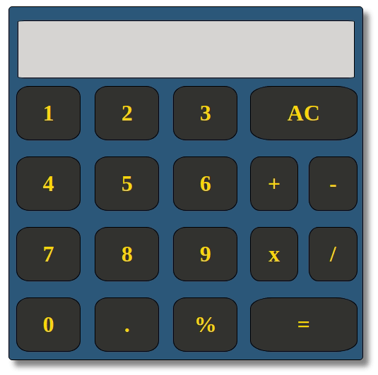
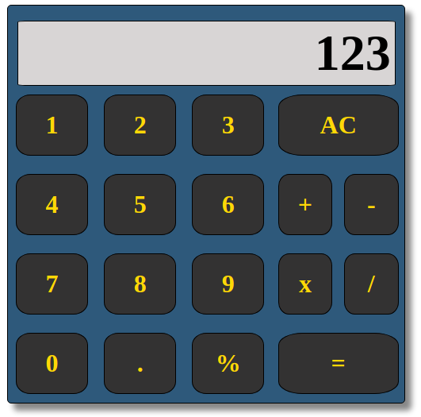

<h4 align="center">

</h4>

## Calculator

Calculator that can perform basic math functions (+,-,*,/,%).

## Description

Project to make a basic calculator using JavaScript, CSS, and HTML. This calculator can perform basic math functions (add,subtract, multiply, divide, percent) and has additional buttons for Clear and decimals.

## Why?

The point of this project was to practice JavaScript, HTML, and CSS skills such as using click event listeners to trigger JavaScript functions that manipulate the DOM. It was interesting to figure out how to store display values and then implement the logic to perform the required functions while accounting for improper input/use cases. It was also fun to try to use CSS to make a relatively clean design and organize all the elements to look like an actual calculator.

## Usage/Install

Clone/Download the project files and open index.html in browser.
